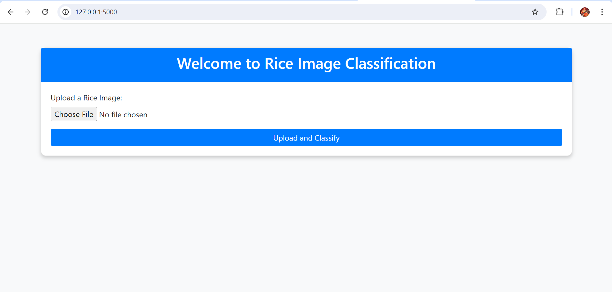
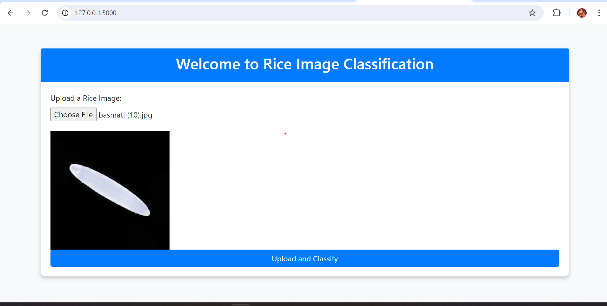
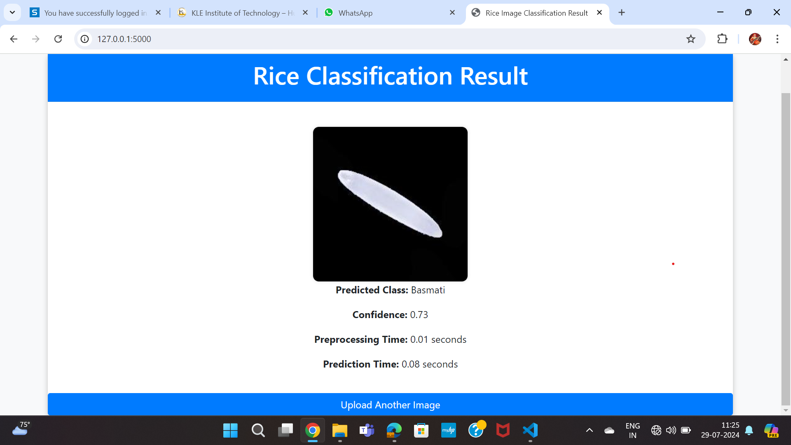
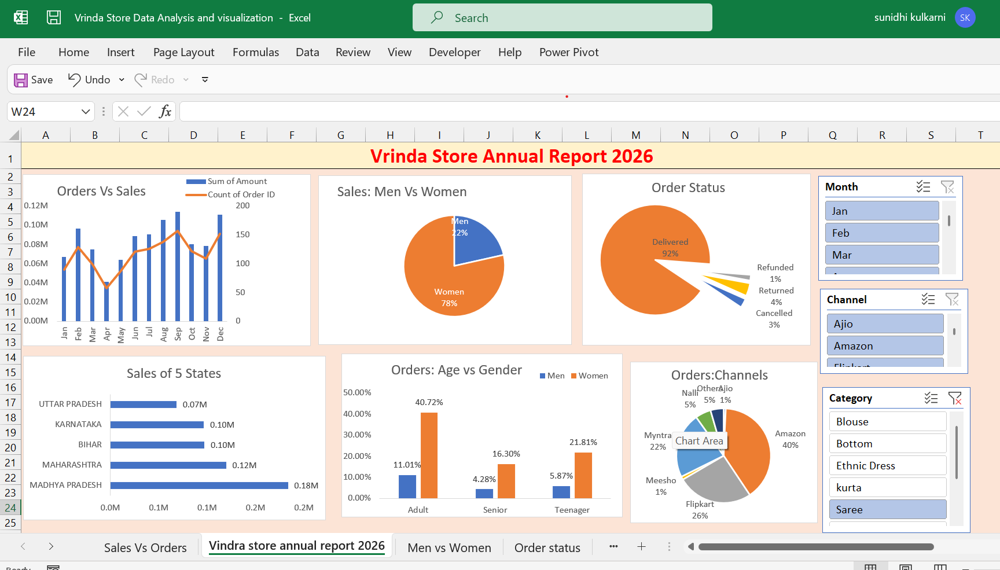

# 👋 Hi, I'm Sunidhi Kulkarni

## 📊 Aspiring Data Analyst | Python | SQL | Power BI | Excel

Passionate Data Analyst with a Bachelor's degree in Computer Science Engineering and hands-on experience in data analysis, data visualization, dashboard development, and machine learning. I enjoy transforming raw data into meaningful insights that drive better business decisions.

---

# 🚀 About Me

- 🎓 Bachelor of Engineering in Computer Science Engineering
- 📈 Passionate about Data Analytics & Business Intelligence
- 💡 Interested in Data Visualization, Dashboard Development & Machine Learning
- 📍 Karnataka, India
- 🌱 Currently learning Advanced Excel, SQL, Power BI & Python

---

# 🛠️ Technical Skills

### Programming Languages
- Python
- SQL
- Java
- HTML

### Data Analytics
- Advanced Excel
- Statistics
- Data Cleaning
- Data Visualization

### Business Intelligence
- Power BI

### Tools
- Visual Studio Code
- SQL Server Management Studio
- Eclipse
- Code::Blocks

---

# 📂 Projects

## 🍚 Rice Image Classification Using Deep Learning

**Tech Stack:** Python • Deep Learning • Computer Vision

### Description
Developed a deep learning model to classify rice grains based on their type and quality using image processing and computer vision techniques.

### Skills Used
- Python
- Deep Learning
- Computer Vision
- Image Processing
- Data Analysis

### Project Screenshots

  
  
  

---

## 🎧 Audio Education for Visually Impaired People

**Tech Stack:** Python • Node.js • Deep Learning

### Description
Developed an AI-based accessibility solution that converts educational content into audio, making learning more accessible for visually impaired users.

### Skills Used
- Python
- Node.js
- Deep Learning
- Accessibility

---

## 🍔 Swiggy Data Analysis (Excel)

### Description
Analyzed Swiggy food delivery data using Microsoft Excel to identify sales trends, restaurant performance, customer ratings, and order patterns. Built an interactive dashboard to support data-driven decision-making.

### Tools Used
- Microsoft Excel
- Pivot Tables
- Pivot Charts
- Slicers
- Conditional Formatting
- Excel Formulas (SUMIFS, COUNTIFS, XLOOKUP)

### Dashboard

  

---

## 🛒 Vrinda General Store Sales Analysis (Excel)

### Description
Analyzed Vrinda General Store sales data to identify customer trends, product performance, and regional sales. Created an interactive dashboard for business insights.

### Tools Used
- Microsoft Excel
- Pivot Tables
- Pivot Charts
- Slicers
- Conditional Formatting
- Excel Formulas (SUMIFS, COUNTIFS, IF, XLOOKUP)

### Dashboard

  

---

# 💼 Internship

## Rabsons Info World
- Completed internship focused on software development and analytical problem-solving.

## Cloud Application Developer
- Successfully completed the Cloud Application Developer course through Roman Technologies.

---

# 📜 Certifications

- 📜 Data Science Course
- 📜 Data Analytics Course
- 📜 Java Full Stack Development (Wipro)

---

# 📚 Currently Learning

- Power BI Dashboard Development
- SQL Query Optimization
- Python for Data Analytics
- Business Analytics
- Data Storytelling
- Machine Learning

---

# 🎯 Career Objective

Seeking an entry-level **Data Analyst** role where I can apply my knowledge of **Python, SQL, Excel, and Power BI** to solve business problems using data-driven insights while continuously learning and growing professionally.

---

# 📫 Connect With Me

📧 **Email:**  
kulkarnisunidhi16@gmail.com

💼 **LinkedIn:**  
https://linkedin.com/in/sunidhi-kulkarni/

---

# ⭐ GitHub Portfolio

This repository showcases my work in:

- 📊 Excel Dashboards
- 📈 Power BI Dashboards
- 🐍 Python Data Analysis
- 🗄️ SQL Projects
- 📉 Exploratory Data Analysis (EDA)
- 🤖 Machine Learning Projects

---

> **"Turning Data into Actionable Insights."**
